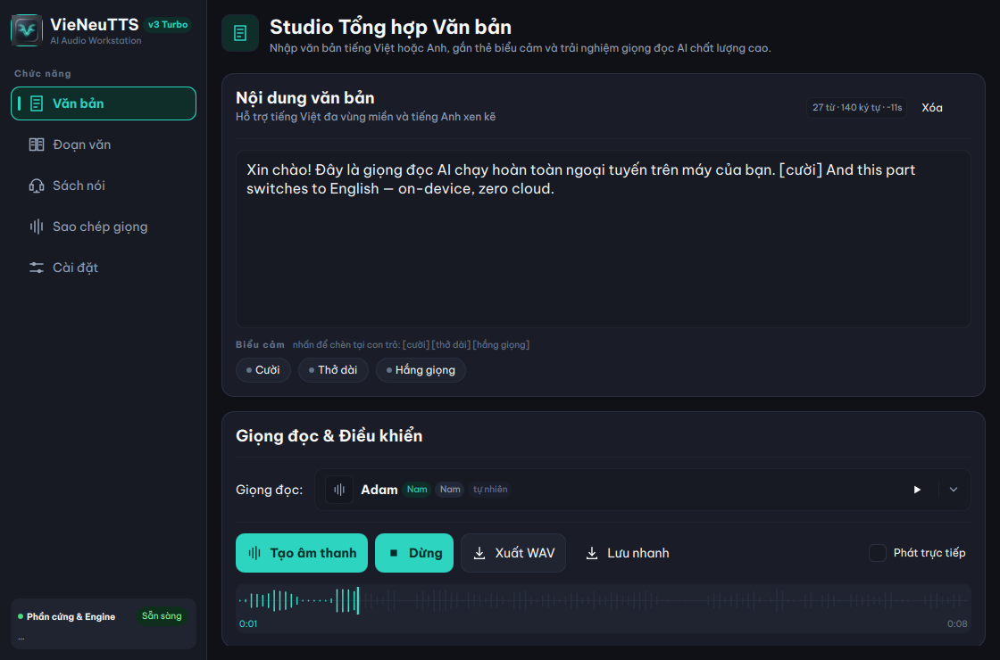
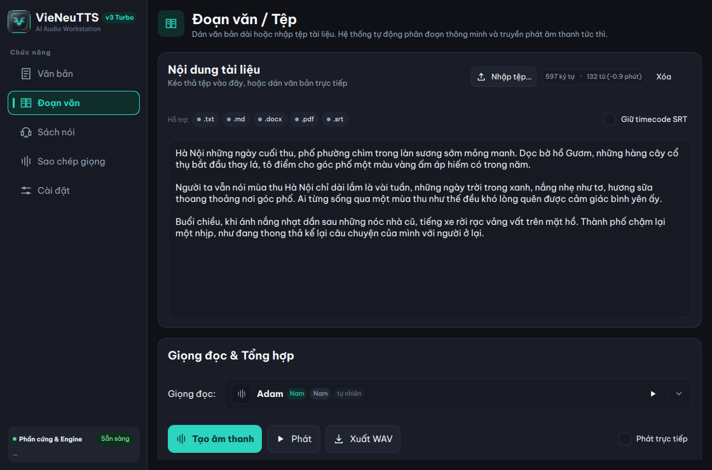
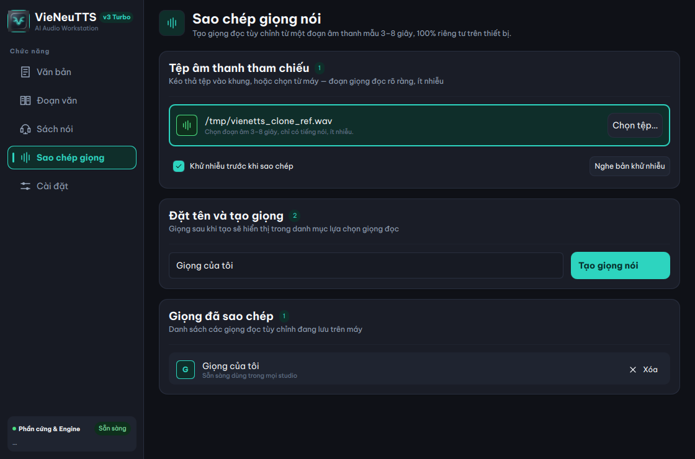
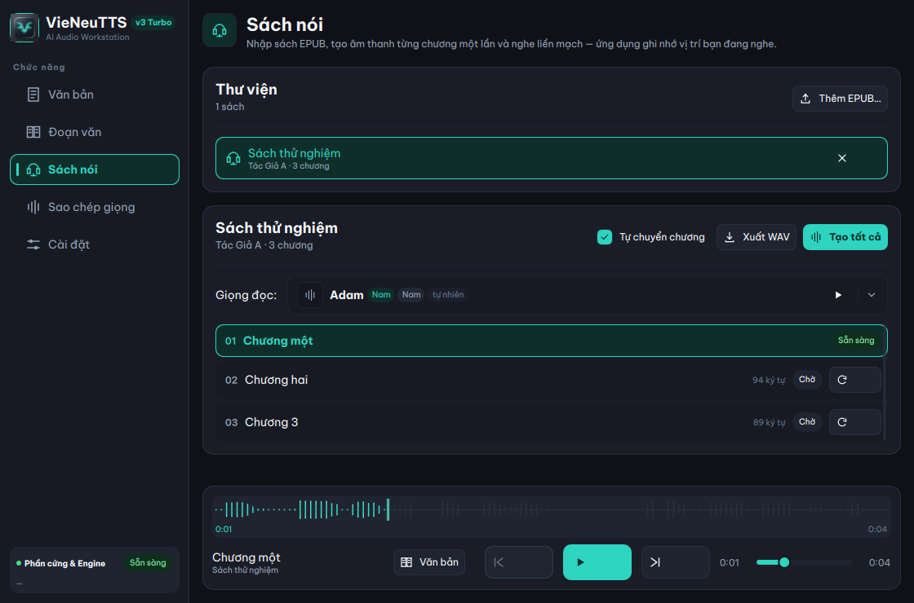
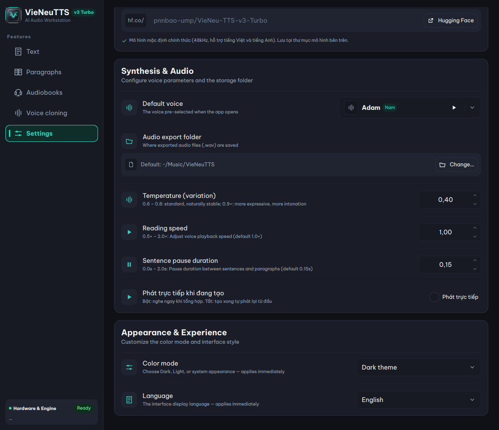

<p align="center">
  
</p>

# VieNeuTTS

**Cross-platform, fully-offline Vietnamese/English text-to-speech workstation.**

Powered by [VieNeu-TTS v3 Turbo](https://huggingface.co/pnnbao-ump/VieNeu-TTS-v3-Turbo)
through the `vieneu` Python SDK. On-device ONNX inference on CPU (int8 by
default) with optional NVIDIA CUDA — no cloud, no telemetry: text and audio
never leave the machine.

<p align="center">
  
  
  
  
</p>

<p align="center">
  
</p>

*The text studio, mid-replay: mixed Vietnamese/English input with an inline
`[cười]` emotion tag, one of ~20 preset voices, and the finished-audio
waveform.*

## Features

### 🎙 Text studio — free-text synthesis

- Vietnamese/English **code-switching** in a single request
- ~20 preset voices grouped **Bắc / Trung / Nam** (North/Central/South), with
  **one-click audition** from the redesigned voice picker — regional pills,
  gender/style badges, search, and cached pre-listen samples that never touch
  your editor text
- Inline emotion tags: `[cười] [thở dài] [hắng giọng]` (the three cues the
  v3 Turbo emotion checkpoint was trained on)
- **Streaming playback** — first chunk observed at about 100 ms in a
  direct-engine measurement on one Apple M4; end-to-end numbers are tracked
  in [docs/performance](docs/performance/README.md)
- 48 kHz WAV export
- **Foreground job state** — the status line under the action bar follows
  your text action (`queued` → `generating`) with its own cancel button.
  Background audiobook renders never flip it, and cancelling a text action
  never drops queued audiobook work.
- **Live preview & silent generation** — the "Phát trực tiếp" toggle is **OFF**
  by default: synthesis generates a clean, validated WAV file directly on disk
  and automatically replays it from the start upon completion. This eliminates
  audio buffer underruns when synthesizing on CPU.

### 📄 Long documents

Import `.txt`, `.md`, `.docx`, `.pdf`, or `.srt` into the paragraph studio and
synthesize long-form text with the same voice controls. Subtitle files import as
clean spoken text by default, with an option to keep the original timecodes.
For texts longer than ~2,000 words or 10,000 characters, synthesize through the
**Audiobook (EPUB) studio** (which splits and caches chapter by chapter) rather
than submitting one giant block to the Text studio. This avoids ONNX Runtime CPU
memory arena growth (~2.5 GB committed memory) and ensures stable processing.
Both studios surface an inline advisory once the input passes 2,000 characters,
pointing at the same guidance.

<p align="center">
  
</p>

### 🧬 Instant voice cloning

Clone any voice from a 3–8 s reference clip — optional denoise, instant
preview, and the cloned voice becomes selectable in every studio.

<p align="center">
  
</p>

### 📚 EPUB audiobook studio

Chapter-aware playback, per-chapter WAV cache, resume, ordered export,
karaoke transcript sync with click-to-seek, render ETA, and render-all
progress.

<p align="center">
  
</p>

### ⚙️ Engine auto-detection, speech tuning & bilingual UI

Automatic CPU/ONNX vs NVIDIA/CUDA detection with manual override. In Settings,
a **reading-speed slider (0.5×–2.0×)** and a **sentence-pause control (0–2 s)**
time-stretch the output with a pure-NumPy WSOLA implementation — pitch is
preserved without the phase-vocoder rumble — on both the batch and streaming
paths. The UI switches between **Tiếng Việt** and English instantly — no
restart.

<p align="center">
  
</p>

## Status

Core features are implemented and tested (895 tests collected at time of
writing). Releases v0.1.0 through v0.1.5 are published through the
tag-triggered pipeline below — every packaged binary is smoke-verified with
real synthesis before it ships. Remaining before a 1.0: macOS notarization
(builds are ad-hoc signed today — see the Gatekeeper notes under Releases)
and the Phase 6 hardening backlog — see [PROJECT_PLAN.md](PROJECT_PLAN.md)
and [conductor/tracks.md](conductor/tracks.md).

## Requirements

- Python 3.10–3.13 (3.13 recommended — the SDK does not support 3.14 yet)
- `uv` for environment management
- A display server for the GUI (the headless smoke CLI works without one)
- Model files cached or bundled (first synthesis needs a one-time download —
  see [Models](#models))

Optional GPU: NVIDIA CUDA >= 12.8.

## Setup

```bash
uv venv --python 3.13 .venv
uv pip install -p .venv/bin/python -e ".[dev]"
```

CUDA build (instead of CPU ONNX):

```bash
uv pip install -p .venv/bin/python -e ".[dev,gpu]"
```

## Models

The packaged app is offline after one-time model setup, not immediately after
application download. On first launch the setup card checks the managed
official CPU baseline, then offers Download, Cancel, Retry, and offline-pack
guidance — no terminal or repository required.

- **Official baseline:** approximately 327 MB download (verified sizes and
  SHA-256 in `src/vienetts_app/core/official_model_manifest.py`). The
  installer preflights free space (download plus 512 MB headroom) before
  starting, downloads to a staging directory, validates every file, then
  atomically promotes the install. An interrupted or invalid staging
  directory is never used.
- **Cancellation/resume:** cancelling stops before the next file or before
  promotion. Already-verified staging files are kept so retry resumes instead
  of re-downloading.
- **Offline after setup:** restart the app with network access disabled and
  synthesize — inference and user content stay on-device and the official
  path never contacts Hugging Face during synthesis.
- **Custom model source (advanced):** the Settings tab “Nguồn mô hình” field
  stays empty for the official baseline. Pasting another `owner/repo` id
  switches to that custom source and disables the official download flow with
  an explicit explanation.
- **Developer-only:** `scripts/fetch_models.py` shares the same committed
  manifest and revision pins for local bundles (`--out models`, `--verify`).
  Packaged users never need it. Use `--precision fp32` for fp32 graphs
  (~455 MB extra) or `--backbone owner/repo` only for explicit custom-repo
  development; custom bundles record `"format": "custom"`.

## Run

```bash
.venv/bin/vienetts-app                # GUI (or: .venv/bin/python -m vienetts_app)
```

Headless smoke test — synthesizes end-to-end and exits 0 only on a valid WAV:

```bash
.venv/bin/vienetts-app --smoke "Xin chào, đây là thử nghiệm"
.venv/bin/vienetts-app --smoke "Hello world" --voice "Trúc Ly" --stream -o /tmp/out.wav
```

Options:

| Flag | Description |
| --- | --- |
| `--smoke TEXT` | Synthesize TEXT end-to-end and exit (omit to open the GUI) |
| `--voice ID`   | Preset voice id (default: `Adam`) |
| `--stream`     | Use the streaming synthesis path |
| `-o, --output` | Output WAV path (default: `out.wav`) |

The smoke run prints the detected engine, then `output: <path> (<N>s)` on
success. It exercises real synthesis through the threaded worker — useful as
a full-stack check without the UI.

## UI language

The interface is bilingual: **Tiếng Việt** (the source language) and
**English**. Switch it in *Settings → Appearance → Ngôn ngữ* — the change
applies instantly (no restart) and persists; `system` follows the OS locale,
defaulting to Vietnamese. Strings already shown in an error banner or a
transient toast when you switch keep the old language until the next event.

When adding or changing user-facing strings, regenerate the English catalog
with:

```bash
scripts/update_i18n.sh        # lupdate merge → translate new entries → recompile .qm
```

The unit suite fails on unfinished catalog entries, so untranslated strings
block the quality gates.

## Development

### Quality gates

```bash
.venv/bin/ruff check .
.venv/bin/ruff format --check .
.venv/bin/pytest
```

### Regenerate the README screenshots

The screenshots in this README are real captures of the running app (real
synthesis included). After UI changes, refresh them with:

```bash
.venv/bin/python scripts/generate_screenshots.py
```

It drives the app through the same seams as the smoke tests, plays two short
audio blips (the hero waveform is grabbed mid-replay), isolates the audiobook
library to a throwaway data dir, and removes the demo voice/book from your
real data afterwards.

### Project layout

```
src/vienetts_app/
  core/     engine, models, settings, detectors, importers, EPUB
  workers/  inference worker (QThread owning the SDK instance)
  ui/       PySide6 controllers + QML surface
  app.py    GUI bootstrap (QGuiApplication + QQmlApplicationEngine)
  __main__.py  entry point: GUI + --smoke CLI
scripts/     model fetch/verify, icon generation, README screenshots
tests/       unit, integration, smoke, fixtures
conductor/   context-driven dev tracks (product, tech-stack, patterns)
```

### Releases

Every push and pull request runs CI (ruff + full test suite, offscreen Qt) on
Ubuntu and Windows — the two platforms nobody develops on. Releases are built
by the tag-triggered Release workflow: pushing a `v*` tag runs the full
pipeline on Windows, macOS and Ubuntu; `gh workflow run Release` does a dry
run of everything except publishing.

```bash
git tag v0.1.0 && git push origin v0.1.0   # tests → build → verify → Release
```

Each platform job runs the whole test suite (offscreen Qt), freezes the app
with PyInstaller (`packaging/vienetts-app.spec`), then **runs real synthesis
through the packaged binary** and validates the output WAV is audible speech
(`scripts/check_smoke_wav.py`). The GitHub Release gets:

| Platform | Artifact | Notes |
|---|---|---|
| Windows x64 | `VieNeuTTS-<ver>-windows-x64.zip` | unzip, run `VieNeuTTS/VieNeuTTS.exe` |
| macOS Apple Silicon | `VieNeuTTS-<ver>-macos-arm64.dmg` | arm64-only; unsigned (see below) |
| Linux x64 | `VieNeuTTS-<ver>-linux-x64.zip` | built on Ubuntu 22.04 (glibc 2.35); run `share/linux/install.sh` for a menu entry |

Model weights (~750 MB, CPU int8) are **not** in the artifacts — the app
downloads them to the Hugging Face cache on first synthesis, so the first
voice generation needs an internet connection.

**macOS Gatekeeper:** the `.dmg` is ad-hoc signed (no Apple Developer ID, so no
notarization), and the first launch is blocked by Gatekeeper with
"Apple cannot check it for malicious software". The override depends on the
macOS version (Apple removed the right-click bypass in Sequoia):

- **macOS 15 Sequoia and later (incl. macOS 26 Tahoe):** try to open the app
  once (the block "registers" it), then open **System Settings → Privacy &
  Security**, scroll down to the Security section and click **Open Anyway** →
  **Open** (admin password or Touch ID). The app is then saved as an exception
  and opens normally from then on.
  ([Apple: Safely open apps on your Mac](https://support.apple.com/en-us/102445))
- **macOS 14 Sonoma and earlier:** right-click the app → **Open** → **Open**.
- **Any version, via Terminal** (skips the Gatekeeper first-run check
  entirely): `xattr -dr com.apple.quarantine /Applications/VieNeuTTS.app`,
  then double-click the app.

Macs managed by an employer (MDM) may block unsigned apps entirely with no
override available.

**Windows audio stability & long text guidance:**
- **Live preview vs. silent generation:** The "Phát trực tiếp" (Live preview)
  toggle is **OFF** by default. Audio streams directly into a validated WAV file
  on disk and auto-replays from the start upon completion. Keeping this off
  prevents Windows WASAPI audio buffer underruns and device restart loops during
  CPU synthesis.
- **Synthesizing long texts:** For long documents or chapters (>2,000 words /
  10,000 characters), use the **Audiobook studio (EPUB)**. Generating very long
  text in a single request causes the ONNX Runtime CPU memory arena to expand to
  ~2.5 GB committed memory, which cannot be released back to the OS until the
  process exits. Splitting into chapters keeps memory bounded.

**Linux audio:** QtMultimedia plays through the system GStreamer stack, which
the zip does not bundle. On minimal installs, install it if playback shows the
"cannot play audio" banner:

```bash
sudo apt install libgstreamer1.0-0 gstreamer1.0-plugins-base \
  gstreamer1.0-plugins-good gstreamer1.0-plugins-bad
```

```bash
# Local reproduction of what CI builds and verifies:
.venv/bin/python -m PyInstaller packaging/vienetts-app.spec --noconfirm \
    --distpath dist --workpath /tmp/pyi-build
dist/VieNeuTTS.app/Contents/MacOS/VieNeuTTS --smoke "Xin chào" -o /tmp/smoke.wav
.venv/bin/python scripts/check_smoke_wav.py /tmp/smoke.wav
```

## License

Apache-2.0 (model + SDK). Qt/PySide6 is LGPL v3, dynamically linked. The UI
font (Be Vietnam Pro) is SIL OFL 1.1.
